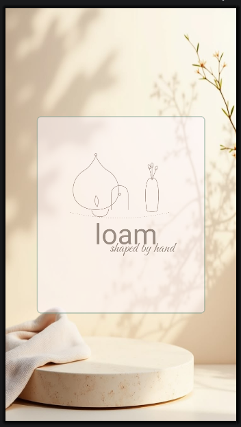
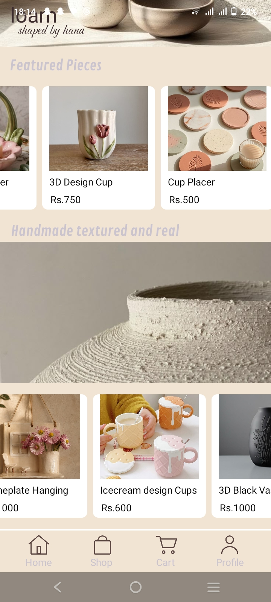
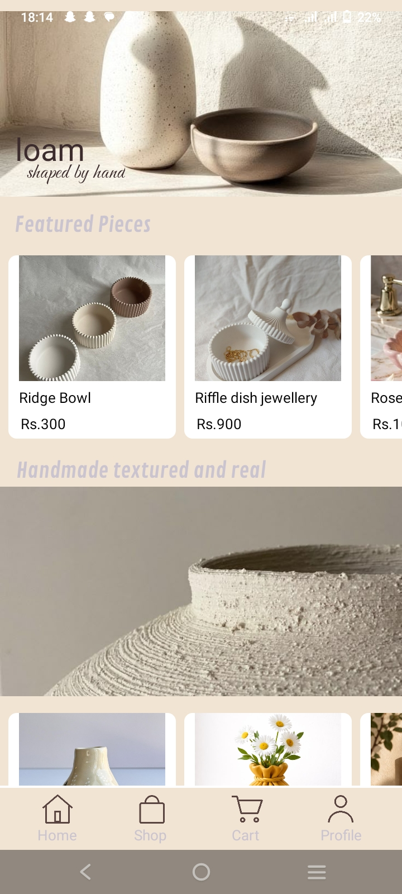
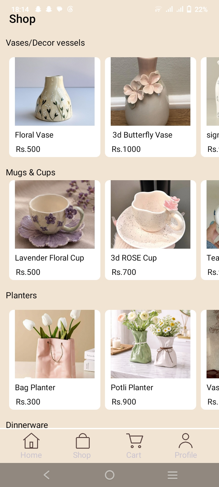
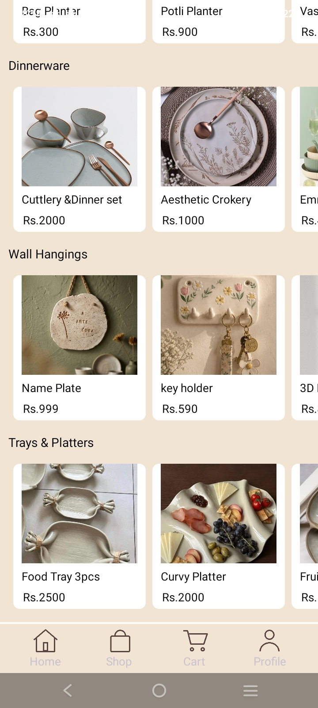
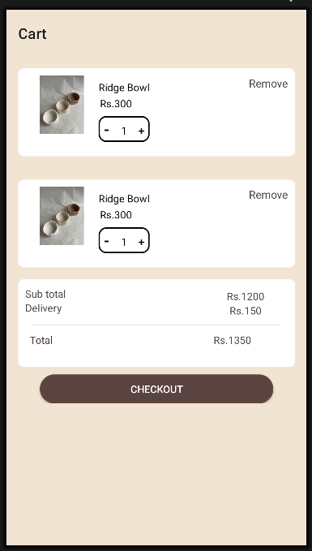
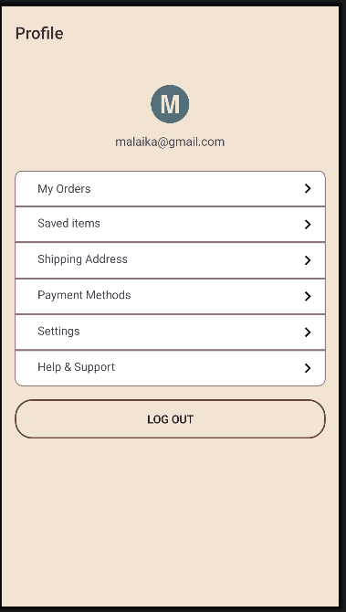

<div align="center">

# 🏺 loam
### *shaped by hand*

A native Android pottery marketplace app — browse and shop handmade ceramic pieces, built end-to-end in Kotlin.


</div>

<br>

Loam is a pottery-only crafts marketplace app — vases, mugs, planters, dinnerware, wall hangings, trays, and more — wrapped in a warm, tactile interface that mirrors the handmade products it sells.

<br>

## <sub>01</sub> 🌅 Onboarding

<table>
<tr>
<td width="33%"><p align="center"><sub><b>SPLASH</b></sub></p></td>
<td width="33%"><p align="center"><sub><b>SIGN IN</b></sub></p></td>
<td width="33%"><p align="center"><sub><b>SIGN UP</b></sub></p></td>
</tr>
</table>

A frosted-panel auth flow on a warm sunrise background, carrying the wordmark and line-art pot & vase logo through every screen.

<br>

## <sub>02</sub> 🏠 Home

<table>
<tr>
<td width="50%"><p align="center"><sub><b>HOME — TOP</b></sub></p></td>
<td width="50%"><p align="center"><sub><b>HOME — SCROLLED</b></sub></p></td>
</tr>
</table>

Hero banner → horizontally scrolling **Featured Pieces** → textured clay banner → more product cards.

<br>

## <sub>03</sub> 🛍️ Shop

<table>
<tr>
<td width="50%"><p align="center"><sub><b>CATEGORIES</b></sub></p></td>
<td width="50%"><p align="center"><sub><b>MORE CATEGORIES</b></sub></p></td>
</tr>
</table>

Full catalog organized by category: **Vases/Decor Vessels · Mugs & Cups · Planters · Dinnerware · Wall Hangings · Trays & Platters.**

<br>

## <sub>04</sub> 🛒 Cart &nbsp;·&nbsp; 👤 Profile

<table>
<tr>
<td width="50%"><p align="center"><sub><b>CART</b></sub></p></td>
<td width="50%"><p align="center"><sub><b>PROFILE</b></sub></p></td>
</tr>
</table>

Quantity steppers, subtotal/delivery/total, checkout — plus a profile hub for orders, saved items, addresses, payment, and settings.

<br>

## 🛠️ Tech Stack

| Layer | Choice |
|---|---|
| Language | Kotlin |
| UI | XML layouts (LinearLayout / RelativeLayout / ConstraintLayout) |
| IDE | Android Studio |
| Navigation | Custom nav screen — FrameLayout + tab row, manual view switching (no Fragment API) |

## 📁 Project Structure

```
app/
├── SplashActivity / onboarding
├── SignUpActivity
├── SignInActivity
├── NavigationActivity2        # hosts bottom nav + manual screen switching
│   ├── HomeView
│   ├── ShopView
│   ├── CartView
│   └── ProfileView
└── res/
    ├── layout/
    ├── drawable/
    └── values/
```

## 🎨 Palette

<div align="center">

|  |  |  |  |  |
|:---:|:---:|:---:|:---:|:---:|
| Rust `#C24E2A` | Emerald `#1E5B4F` | Gold `#C9962C` | Berry `#8C2F4B` | Ink `#221A15` |

</div>

## 🗺️ Roadmap

- [ ] Wire up `RecyclerView` for reusable product data across Home and Shop
- [ ] Connect Cart quantity/remove actions to real state
- [ ] Hook up Profile sub-pages (Orders, Saved Items, Shipping, Payment, Settings)
- [ ] Backend/data layer integration

<br>

<div align="center">
<i>shaped by hand, pixel by pixel 🏺</i>
</div>
